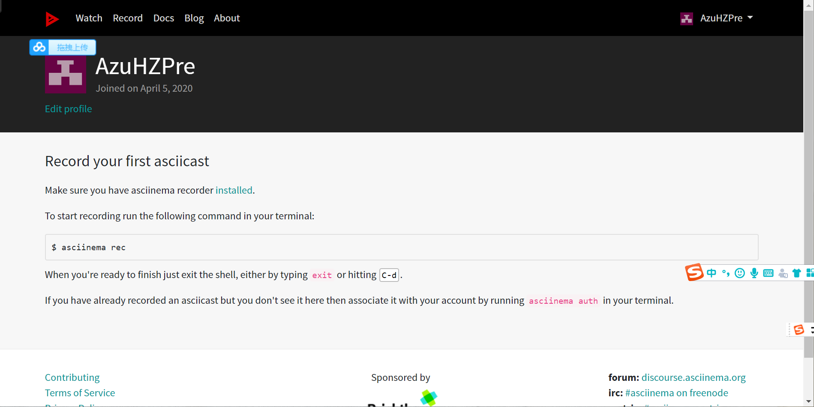
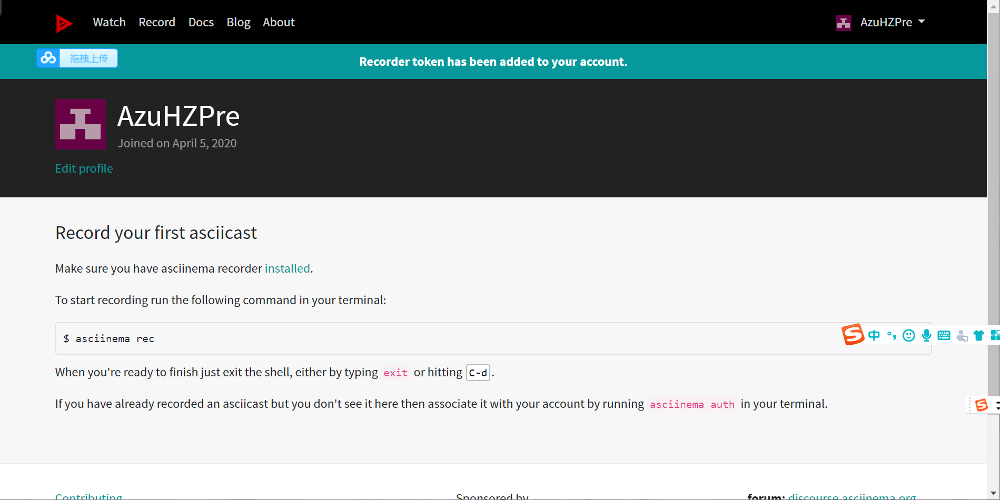
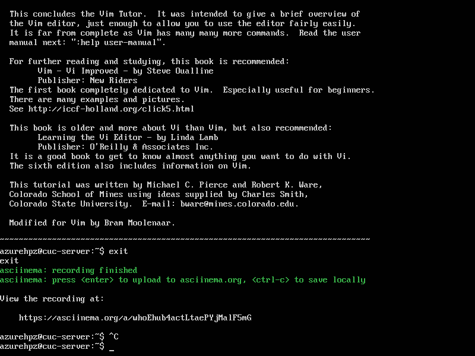

# 第二章：（实验）
## From GUI to CLI

# 软件环境
- Ubuntu 18.04 Server 64bit

# 实验问题和实验报告要求
- 在`asciinema`注册一个账号，并在本地安装配置好asciinema
- 确保本地已经完成`asciinema auth`，并在`asciinema`成功关联了本地账号和在线账号
- 上传本人亲自动手完成的`vimtutor`操作全程录像
- 在自己的github仓库上新建`markdown`格式纯文本文件附上`asciinema`的分享URL
- 提醒 避免在终端操作录像过程中暴漏密码、个人隐私等任何机密数据

# 实验过程
## step1:在asciinema注册账号，并在本地安装配置好
- 注册完成

* 在Ubuntu环境下安装asciinema

> sudo apt-add-repository
> ppa:zanchey/asciinema
>
> sudo apt-get update
>
> sudo apt-get install asciinema

- 关联本地asciinema账号
> asciinema auth

## step2:用asciinema录制vimtutor全程操作
这次是第二次录制，所以操作会比较快。第一次录制由于操作不熟好像按了`Ctrl+c`保存到本地了，但是也没有找到在哪里。

[AzureHPZ的asciinema](https://asciinema.org/a/whoEhub4actLtaePYjMalF5mG)

# VIMTUTOR完成后的自查清单
- 你了解vim有哪几种工作模式？

    1.一般模式:以vi打开一个档案就直接进入一般模式了（这是默认的模式）。在这个模式中， 你可以使用『上下左右』按键来移动光标，你可以使用『删除字符』或『删除整行』来处理档案内容， 也可以使用『复制、贴上』来处理你的文件数据。

    2.编辑模式:在一般模式中可以进行删除、复制、粘贴等的动作，但是却无法编辑文件内容的！要等到你按下`i, I, o, O, a, A, r, R`等任何一个字母之后才会进入编辑模式。这是要退出就要按下ESC键。

    3.指令模式：在一般模式当中，输入` : / ?`3个中的任何一个按钮，就可以将光标移动到最底下那一行。在这个模式当中， 可以提供你『搜寻资料』的动作，而读取、存盘、大量取代字符、离开`vi`、显示行号等动作是在此模式中达成的！

------------------------
- Normal模式下，从当前行开始，一次向下移动光标10行的操作方法？如何快速移动到文件开始行和结束行？如何快速跳转到文件中的第N行？

    - 一次向下移动光标10行：`10j`
    - 快速移动到文件开始行：`gg`
    - 快速移动到文件结束行：`G`
    - 快速跳转到文件中的第N行：`N+G`

-------------
- Normal模式下，如何删除单个字符、单个单词、从当前光标位置一直删除到行尾、单行、当前行开始向下数N行？
    - 删除单个字符：`dr`(向左删除）/`dl`（向右删除)/`x`
    - 删除单个单词：`dw`(光标在单词开头)/`de`(光标在单词结尾)
    - 从当前光标位置一直删除到行尾：`d$`
    - 删除单行：`dd`
    - 从当前行开始向下数N行：`Ndd`

----
- 如何在vim中快速插入N个空行？如何在vim中快速输入80个-？
    - 快速插入N个空行：`N+o`(向下插入)/`N+O`(向上插入)/`N+I`/`N+a`
    - 快速输入80个-：`80[i/a]-`
----
- 如何撤销最近一次编辑操作？如何重做最近一次被撤销的操作？
    - 撤销最近一次编辑操作：`u`
    - 重做最近一次被撤销的操作：`Ctrl+r`
----
- vim中如何实现剪切粘贴单个字符？单个单词？单行？如何实现相似的复制粘贴操作呢？
    - 剪切黏贴：在vim中最近一次删除的内容会被保存在剪切板中，所以对于剪切粘贴操作，无论是字符、单词、行还是内容块，只需要在相应删除它们的操作后按p即可。
    - 复制黏贴：
        - 单个字符：`ylp`
        - 单个单词：`ywp`
        - 单行：`yyp`
        - 内容块：`v`+`yp`
----
- 为了编辑一段文本你能想到哪几种操作方式（按键序列）？
    - `v`+`nh`/`nj`/`nk`+`nl`(选择文本内容块)
    - `Nyyp/Nddp`(删除并替换)
    - `i/No`(插入)
    - `r`(替换)
    - `NG`(跳到指定行)
    - `:wq`(保存并退出)
----
- 查看当前正在编辑的文件名的方法？查看当前光标所在行的行号的方法？
    - `Ctrl+g`
----
- 在文件中进行关键词搜索你会哪些方法？如何设置忽略大小写的情况下进行匹配搜索？如何将匹配的搜索结果进行高亮显示？如何对匹配到的关键词进行批量替换？
    - 关键词搜索：`/+关键词`
    - 忽略大小写：`:set ic`
    - 高亮显示：`:set hlserach`
    - 批量替换：`%s/old/new/gic`
 ----
- 在文件中最近编辑过的位置来回快速跳转的方法？
    - `Ctrl+o/i`
----
- 如何把光标定位到各种括号的匹配项？例如：找到(, [, or {对应匹配的),], or }
    - 将光标移动到需要进行匹配的字符下输入`%`
----
- 在不退出vim的情况下执行一个外部程序的方法？
    - 输入`:![command]`
----
- 如何使用vim的内置帮助系统来查询一个内置默认快捷键的使用方法？如何在两个不同的分屏窗口中移动光标？
    - 查询一个内置默认快捷键：`:help+[快捷键]`
    - 在两个不同分屏窗口移动光标：`Ctrl+w`
----

# 参考文献
- [Vim的工作模式](https://jingyan.baidu.com/article/dca1fa6f9bee2db0a540522d.html)

- [使用Vim创建和编辑文本文件](https://blog.csdn.net/qinfuan2017/article/details/79728906)