# 第五章：Web服务器（实验）
---
## 软件环境
- Nginx
- VeryNginx
- Wordpress4.7
- Damn Vulnerable Web Application (DVWA)

## 实验检查点
- 基本要求
    - 在一台主机（虚拟机）上同时配置Nginx和VeryNginx
        - VeryNginx作为本次实验的Web App的反向代理服务器和WAF
        - PHP-FPM进程的反向代理配置在nginx服务器上，
        VeryNginx服务器不直接配置Web站点服务
   - 使用Wordpress搭建的站点对外提供访问的地址为： http://wp.sec.cuc.edu.cn
   - 使用Damn Vulnerable Web Application (DVWA)搭建的站点对外提供访问的地址为： http://dvwa.sec.cuc.edu.cn
- 安全加固要求
   - 使用IP地址方式均无法访问上述任意站点，并向访客展示自定义的友好错误提示信息页面-1
   - Damn Vulnerable Web Application (DVWA)只允许白名单上的访客来源IP，其他来源的IP访问均向访客展示自定义的友好错误提示信息页面-2
   - 在不升级Wordpress版本的情况下，通过定制VeryNginx的访问控制策略规则，热修复WordPress < 4.7.1 - Username Enumeration
   - 通过配置VeryNginx的Filter规则实现对Damn Vulnerable Web Application (DVWA)的SQL注入实验在低安全等级条件下进行防护
- VeryNginx配置要求
   - VeryNginx的Web管理页面仅允许白名单上的访客来源IP，其他来源的IP访问均向访客展示自定义的友好错误提示信息页面-3
   - 通过定制VeryNginx的访问控制策略规则实现：
      - 限制DVWA站点的单IP访问速率为每秒请求数 < 50
      - 限制Wordpress站点的单IP访问速率为每秒请求数 < 20
      - 超过访问频率限制的请求直接返回自定义错误提示信息页面-4
      - 禁止curl访问

## 实验过程
### 软件和环境配置
#### 1.安装Nginx
              
    sudo apt-get install nginx
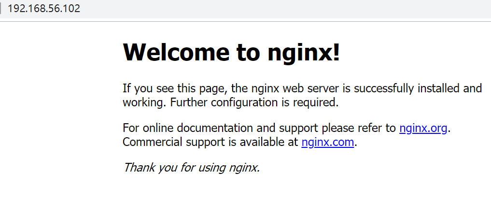
#### 2.配置Verynginx
    
- 依赖库

      sudo apt install openssl1.0
      sudo apt install libssl1.0-dev
      sudo apt install lua-rex-pcre
      sudo apt install build_essential
      sudo apt-get install libpcre3 libpcre3-dev
      sudo apt-get install zlib1g-dev
- 克隆仓库到本地后进行安装

      git clone https://github.com/alexazhou/VeryNginx.git
      cd VeryNginx
      sudo python install.py install
- 修改配置文件
     
      sudo vim /opt/verynginx/openresty/nginx/conf/nginx.conf
      
      listen server :80
      user www-data
- 通过自己IP地址+配置端口进入verynginx
      http://IP:80/verynginx/index.html
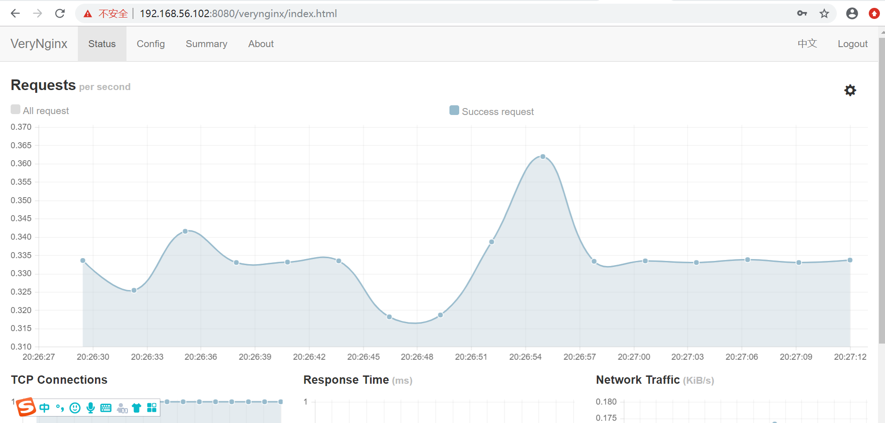
#### 3.安装wordpress
- 下载mysql、php和相关扩展
  
      sudo apt install mysql-server
      # 检查是否正常运行
      sudo mysql -u root -p

      # 安装php
      sudo apt install php-fpm php-mysql
      sudo apt install php-curl php-gd php-intl php-mbstring php-soap php-xml php-xmlrpc php-zip
      sudo systemctl restart php7.2-fpm
- 建立数据库

      CREATE DATABASE wordpress DEFAULT CHARACTER SET utf8 COLLATE utf8_unicode_ci;

      GRANT ALL ON wordpress.* TO 'wpuser'@'localhost' IDENTIFIED BY 'wpuser';

       FLUSH PRIVILEGES;
- 下载wordpress
      
      sudo wget https://wordpress.org/wordpress-4.7.zip
      unzip wordpress-4.7.zip(sudo apt install unzip)
      
      # 移动文件夹到指定目录
      cp /tmp/wordpress/wp-config-sample.php /tmp/wordpress/wp-config.php
      sudo cp -ar /tmp/wordpress/. /var/www/html/wp.sec.cuc.edu.cn

      # 修改文件夹属主为 www-data
      sudo chown -R www-data:www-data /var/www/html/wp.sec.cuc.edu.cn

- 修改wordpress相关配置文件 

      curl -s https://api.wordpress.org/secret-key/1.1/salt/
      # 用户名，密码和安全钥匙等配置
      sudo vim /var/www/html/wp.sec.cuc.edu.cn/wp-config.php
      

      sudo nginx -t
      # 语法检查
      sudo systemctl restart nginx
      # 重启
      # 登录
      
      
#### 4.安装dvwa
- 下载安装包

      cd /tmp
      git clone https://github.com/ethicalhack3r/DVWA
      sudo mv /tmp/DVWA /var/www/html/dvwa
    
      sudo mv /var/www/html/dvwa/config/config.inc.php.dist /var/www/html/dvwa/config/config.inc.php
- 新建数据库

      sudo mysql -u root -p

      > CREATE DATABASE dvwa DEFAULT CHARACTER SET utf8mb4 COLLATE utf8mb4_unicode_ci;
      > GRANT ALL ON dvwa.* TO 'dvwauser'@'localhost' IDENTIFIED BY 'dvwauser';
      > FLUSH PRIVILEGES;
      > EXIT;
      # 重启
      sudo systemctl restart mysql
- 修改dvwa配置
      
      sudo vim /var/www/html/dvwa/config/config.inc.php 
          
          # 修改以下内容
          $_DVWA[ 'db_database' ] = 'dvwa';
          $_DVWA[ 'db_user' ]     = 'dvwauser';
          $_DVWA[ 'db_password' ] = 'dvwauser';
  
      # 修改文件属主
      sudo chown -R www-data:www-data /var/www/html/dvwa.sec.cuc.edu.cn

      # 修改 nginx 相关配置
      sudo vim /etc/nginx/sites-available/sec.cuc.edu.cn

          server {
                  listen 5566;
                  server_name  dvwa.sec.cuc.edu.cn;

                  root /var/www/html/dvwa.sec.cuc.edu.cn;
                  index index.html index.htm index.php index.nginx-debian.html;

                  location / {
                          try_files $uri $uri/ = 404;
                          }

                  location ~ \.php$ {
                          include snippets/fastcgi-php.conf;
                          fastcgi_pass unix:/var/run/php/php7.2-fpm.sock;
                          }
                          }

      # 修改php相关设置
      sudo vim  /etc/php/7.2/fpm/php.ini

          # 修改以下内容
          allow_url_include = On
          display_errors = off
  
      # 重启php，使配置生效
      sudo systemctl restart php7.2-fpm

      # 重启nginx，使配置生效
      sudo systemctl restart nginx
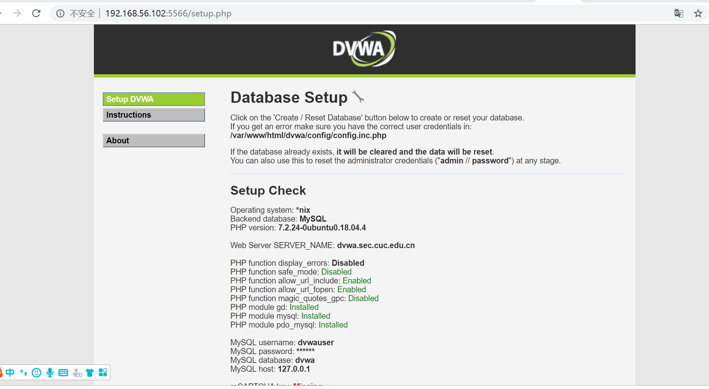
#### 5.环境配置：修改hosts文件(包括虚拟机和本机系统上的)
   
    192.168.56.102 wp.sec.cuc.edu.cn
    192.168.56.102 dvwa.sec.cuc.edu.cn
    192.168.56.102 verynginx.sec.cuc.edu.cn
### 基本要求
#### 1.使用Wordpress搭建的站点对外提供访问的地址为： http://wp.sec.cuc.edu.cn
- 创建Nginx服务器块配置文件
  
      sudo vim /etc/nginx/sites-available/wp.sec.cuc.edu.cn
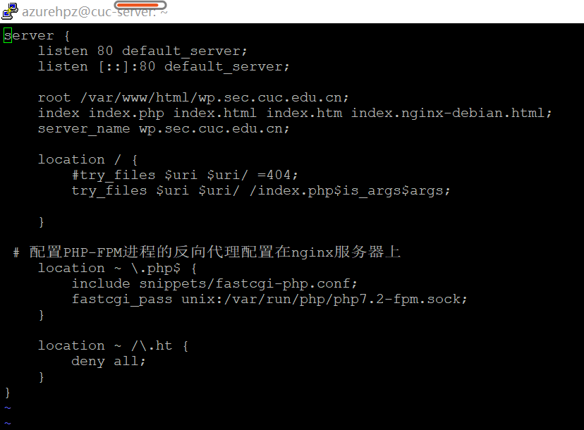
       
       # 创建从Nginx服务器块配置文件（在/etc/nginx/sites-available/目录中）到/etc/nginx/sites-enabled/目录的符号链接来启用新服务器块
       sudo ln -s /etc/nginx/sites-available/wp.sec.cuc.edu.cn /etc/nginx/sites-enabled/

       # 取消链接默认配置文件
       sudo unlink /etc/nginx/sites-enabled/default

       # 测试新配置文件的语法错误并重启服务
       sudo nginx -t
       sudo systemctl reload nginx
- 通过80端口访问wp.sec.cuc.edu.cn,进行用户登录

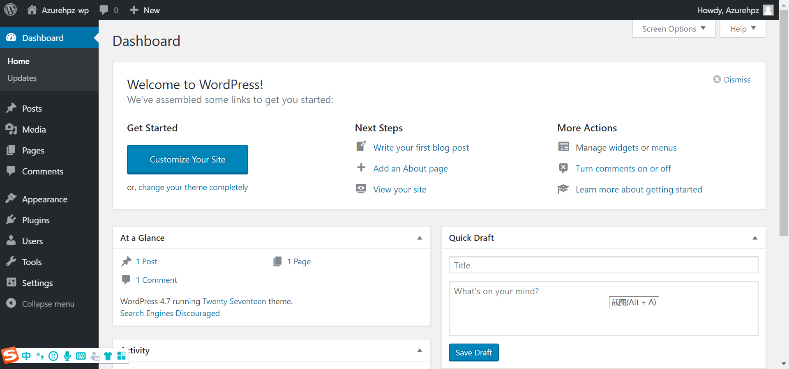
- *为WordPress启用HTTPS
    
    - 创建自签名SSL证书,输入必要的信息以在目录下创建密钥和证书文件/etc/ssl
   
          # 使用OpenSSL创建自签名密钥和证书对
          sudo openssl req -x509 -nodes -days 365 -newkey rsa:2048 -keyout /etc/ssl/private/nginx-selfsigned.key -out /etc/ssl/certs/nginx-selfsigned.crt
    - 配置Nginx使用SSL

          sudo vim /etc/nginx/snippets/self-signed.conf
        插入以下内容：   

        

           sudo vim /etc/nginx/snippets/ssl-params.conf
        插入内容：

        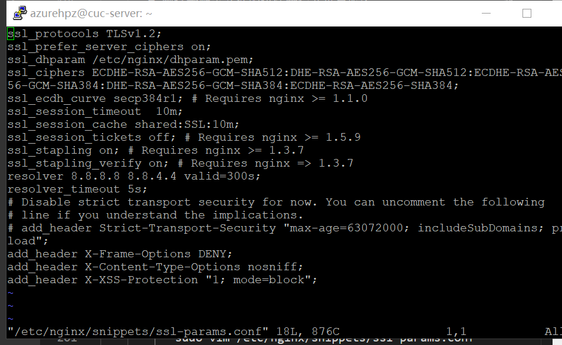

          #检查文件配置语法
          sudo nginx -t
          #重启Nginx
          sudo systemctl restart nginx
          
          sudo vim /opt/verynginx/openresty/nginx/conf/nginx.conf
          #server块中插入
          listen     8433 ssl;

          #重启服务
          sudo /opt/verynginx/openresty/nginx/sbin/nginx -s reload
- 使用443端口访问https://wp.sec.cuc.edu.cn成功

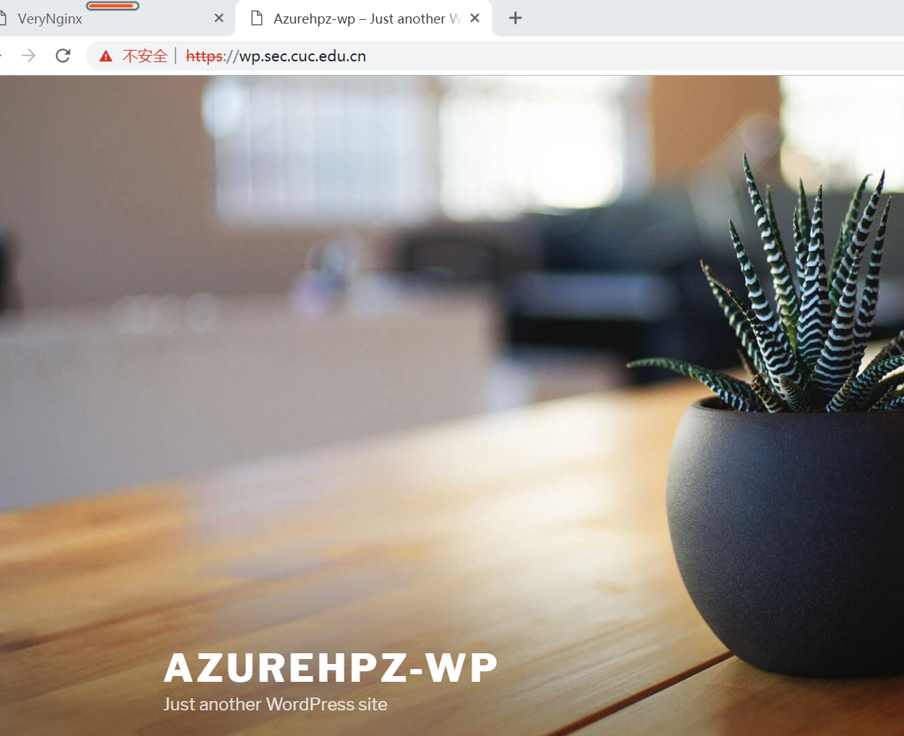

#### 2.使用Damn Vulnerable Web Application (DVWA)搭建的站点对外提供访问的地址为： http://dvwa.sec.cuc.edu.cn
- 创建新服务器块配置文件

      sudo vim /etc/nginx/sites-available/dvwa.sec.cuc.edu.cn
    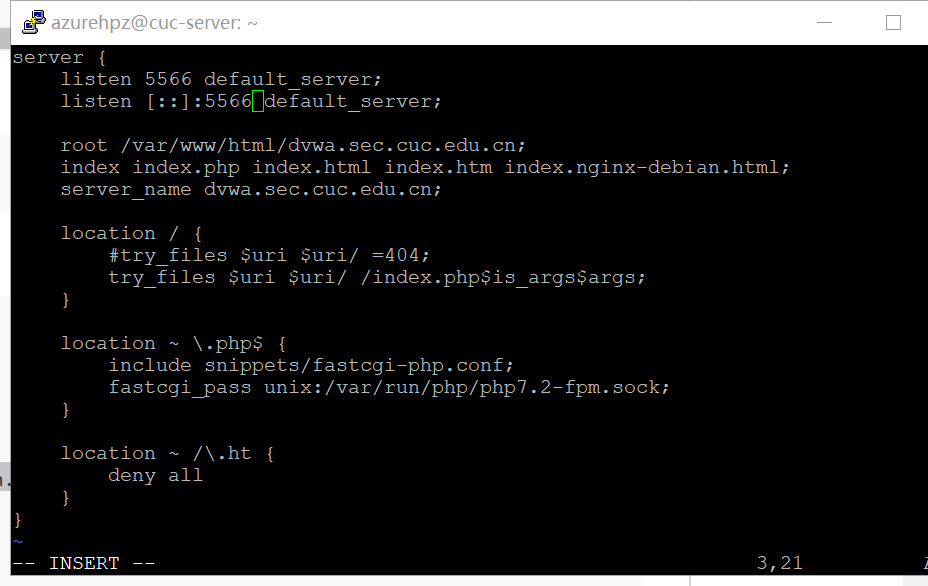
- 创建从新服务器块配置文件（在/etc/nginx/sites-available/目录中）到/etc/nginx/sites-enabled/目录的符号链接来启用新服务器块

      sudo ln -s /etc/nginx/sites-available/dvwa.sec.cuc.edu.cn /etc/nginx/sites-enabled/
      
      # 测试新配置文件的语法错误并重启服务
      sudo nginx -t
      sudo systemctl reload nginx
- 通过端口5566成功访问dvwa.sec.cuc.edu.cn

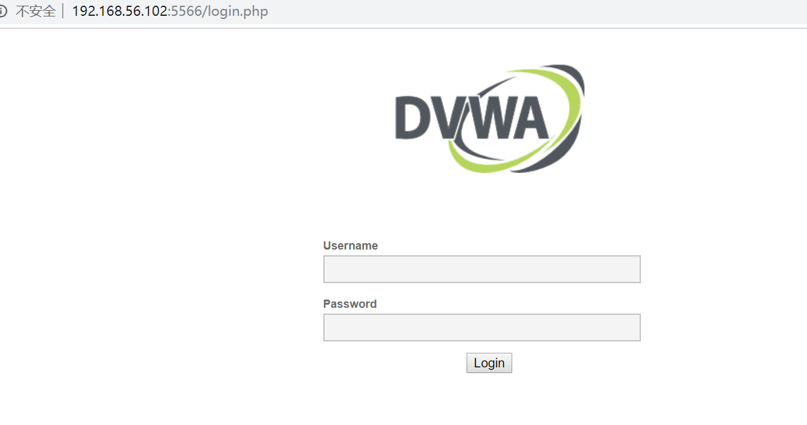
- 登录后成功查看自己设置的数据库数据
 
       #默认用户名和密码
       username:admin
       password:password
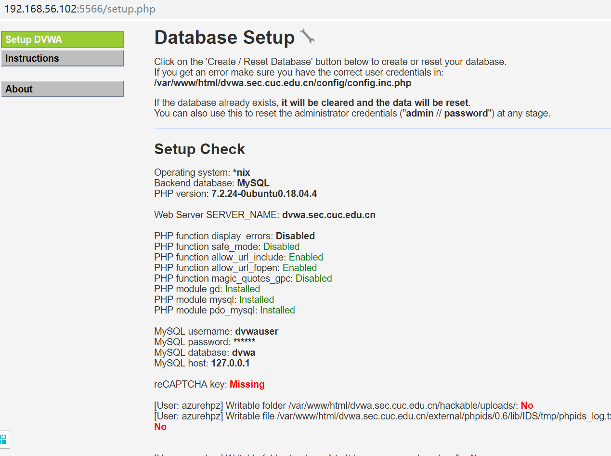
#### 5.VeryNginx里站点访问相应的Matcher,Upstream,Proxy Pass
- Matcher
    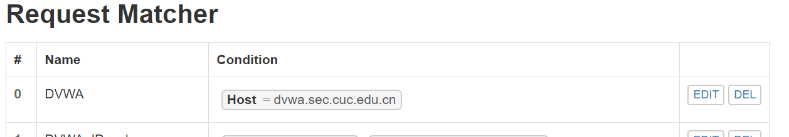
    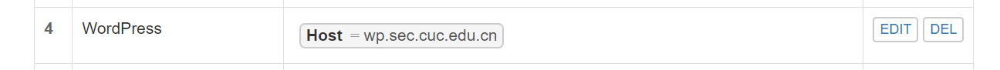

- UPstream and Proxy Pass
    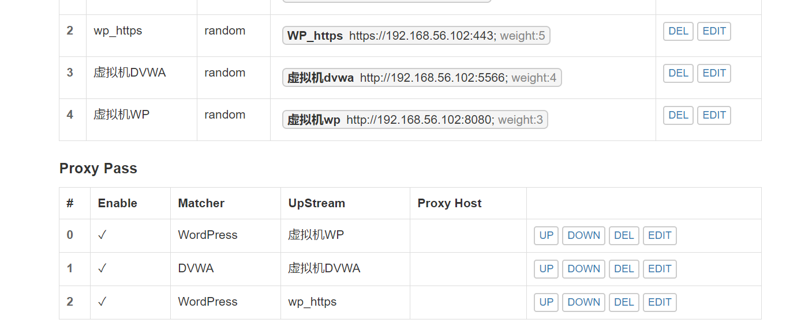
### 安全加固要求
#### 1.使用IP地址方式均无法访问上述任意站点
- 设置`Matcher`：host采用正则表达式匹配IP:\d+\.\d+\.\d+\.\d+
   

- 设置相应`Matcher`的`Response`规则：自定义返回友好错误信息
   
- 设置`Filter`,返回403code及相应`Response`

   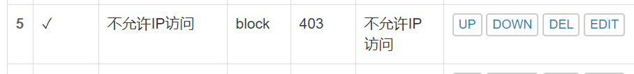
- Result 
   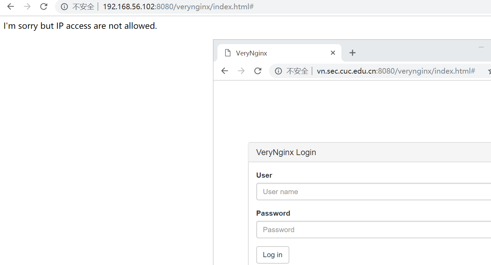
#### 2.DVWA只允许白名单上的访客来源IP
- 设置`Matcher`:
   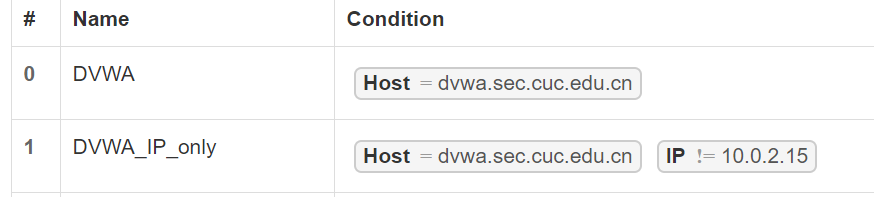

- 设置相应`Matcher`的`Response`规则：自定义返回友好错误信息:
  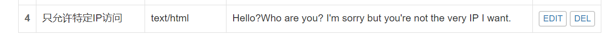

- 设置`Filter`,返回相应`Response`   
  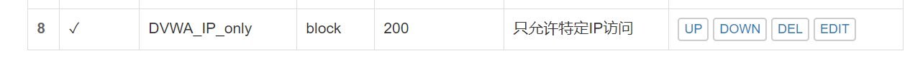
- Result
        
    - 白名单外访客来源IP无法访问
      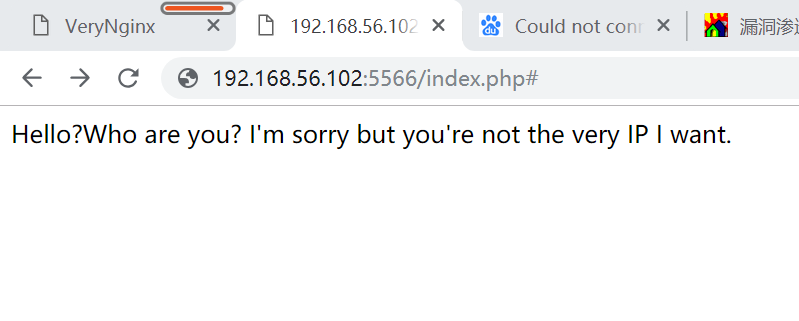   

    - 白名单内访客来源IP被允许
      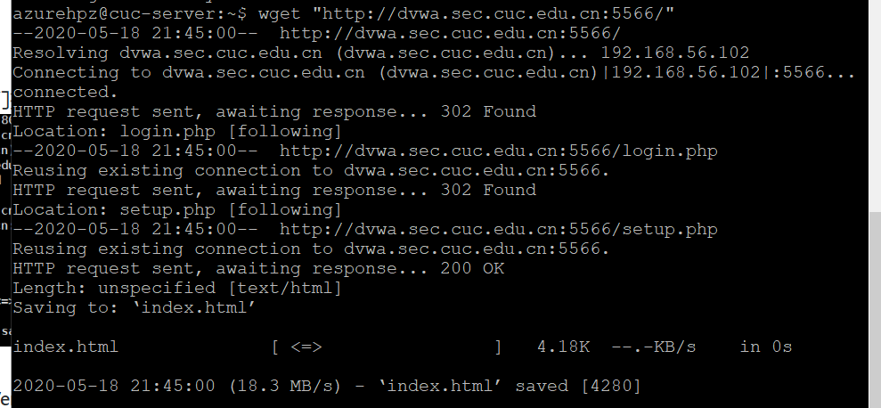
#### 3.在不升级Wordpress版本的情况下，通过定制VeryNginx的访问控制策略规则，热修复WordPress < 4.7.1 - Username Enumeration
- Matcher
    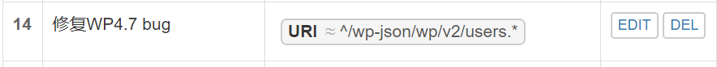

- Filter
    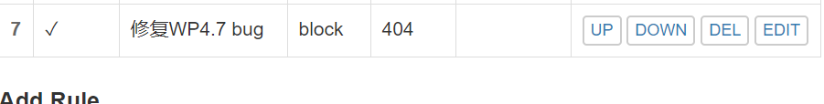

- Result
    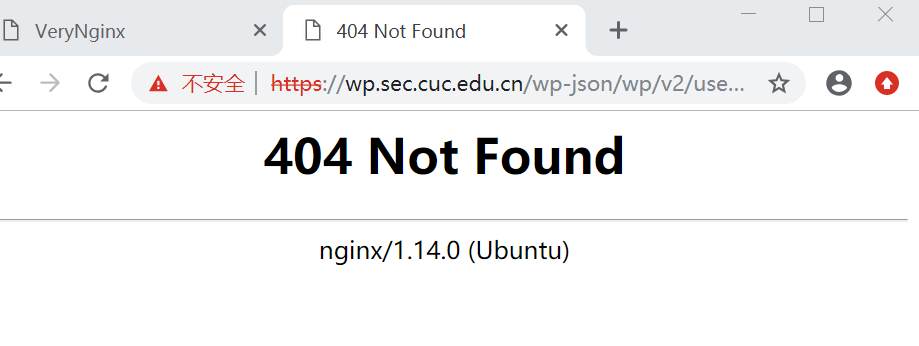
      
#### 4.通过配置VeryNginx的Filter规则实现对Damn Vulnerable Web Application(DVWA)的SQL注入实验在低安全等级条件下进行防护
- Matcher
    

- Result
    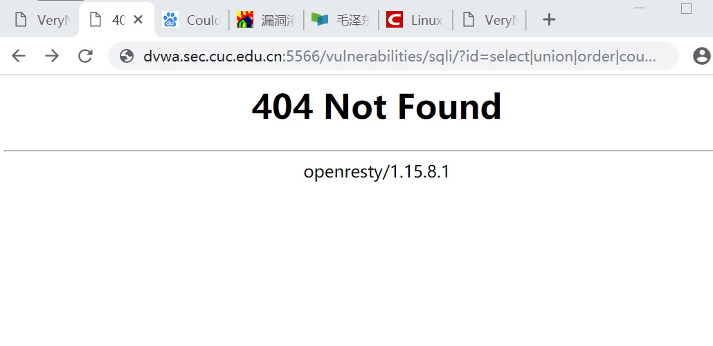
### VeryNginx配置要求
#### 1.VeryNginx的Web管理页面仅允许白名单上的访客来源IP，其他来源的IP访问均向访客展示自定义的友好错误提示信息页面-3
- Matcher
    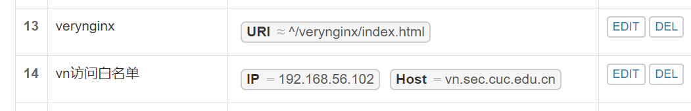

- Filter
    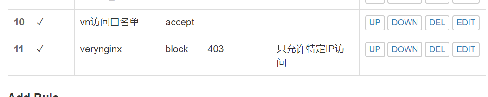

- Result
    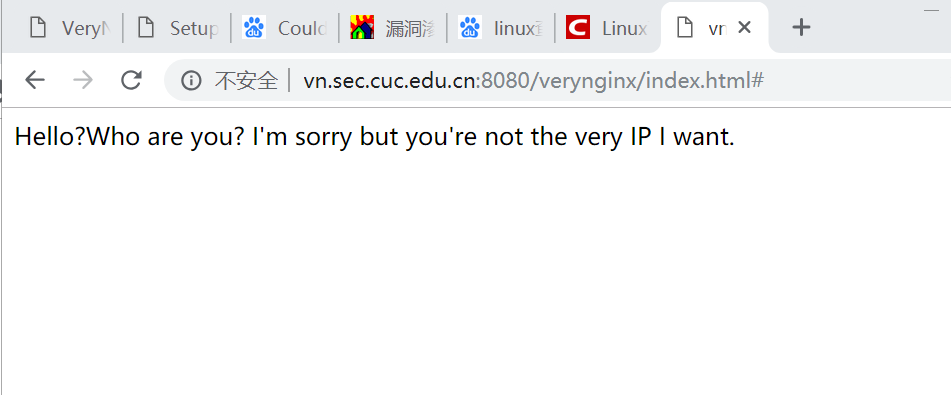
#### 2.限制DVWA站点的单IP访问速率为每秒请求数 < 50, 限制Wordpress站点的单IP访问速率为每秒请求数 < 20, 超过访问频率限制的请求直接返回自定义错误提示信息页面-4
- Frequency Limit
    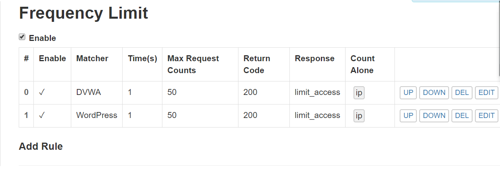

- Linux中操作
      
       sudo apt install apache2-utils
       ab -n 1000 -c 1 -s 1 "http://dvwa.sec.cuc.edu.cn:5566/"
       ab -n 1000 -c 1 -s 1 "http://wp.sec.cuc.edu.cn:8080/"
- Result
      
    - DVWA返回错误提示
      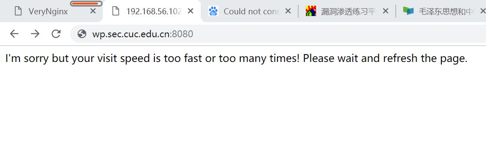

    - Wordpress返回错误提示     
      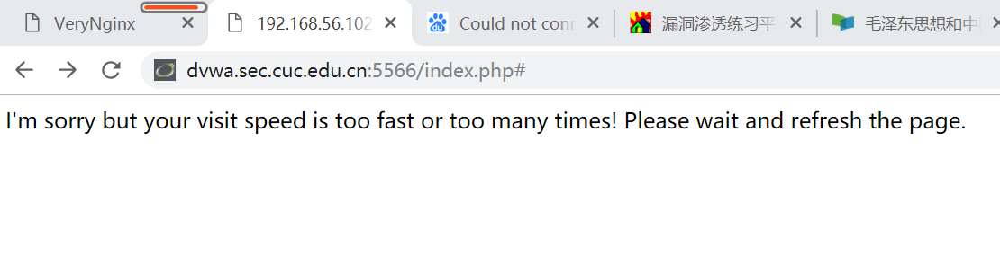
#### 3.禁止curl访问
- `Matcher`中设置`UserAgent`匹配`curl`

- `Fileter`中对上述相应匹配进行`block`
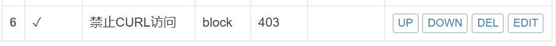
- Result:
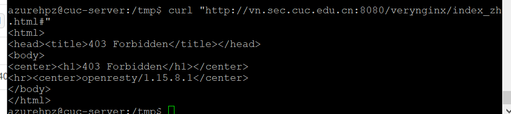
## 实验中出现的问题及解决方案
### 1.配置verynginx进行依赖库安装时使用sudo apt-get install openssl1.0时报错E：unable to locate package XXX.
- 在百度上搜索报错查找解决方案
   - 更新apt源，更换为国内apt源。再执行
           
           sudo apt update
           sudo apt upgrade
        问题解决
### 2.下载wordpress时进行安装包解压时报错： End-of-central-directory signature not found.这有可能是因为文件并非zip文件而是网页文件。
       
       file WordPress-4.7.zip
       # 返回的为Html document，下载路径出错了

       # 重新更改下载路径，再查看下载文件的类型
       file wordpress-4.7.zip
       # 返回为zip archive data,使用unzip成功解压
### 3.安装完DVWA配置登录成功之后，因为调了别的配置，所以导致使用192.168.56.102:5566和dvwa.sec.cuc.edu.cn:5566登录时都显示 
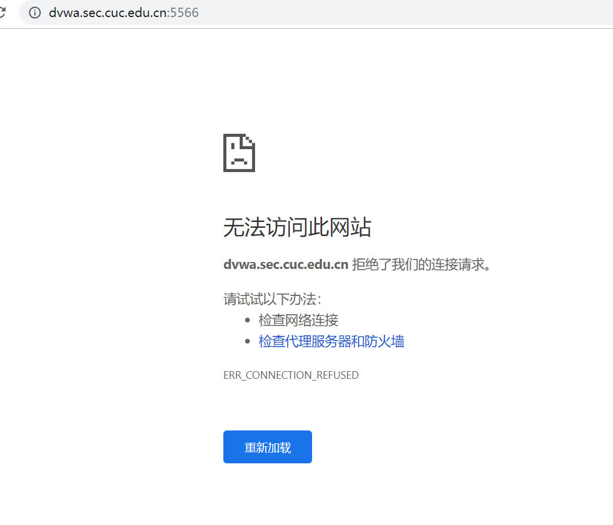
- 赶紧求助师姐，在本地server进行curl操作
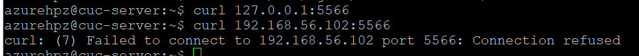
- 查看verynginx和nginx的**access.log和error.log（划重点：这是debug的小方法）**，发现没有新内容增加
- 查看端口被监听的软件
 
      sudo netstat -anp | grep 端口号
    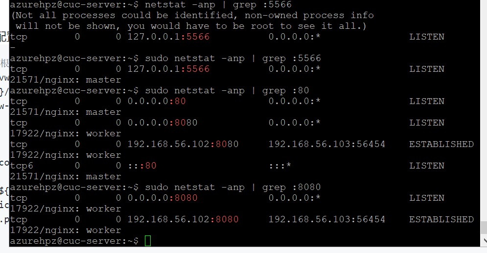
*问题1发现：5566端口只允许localhost访问*
- 于是，修改dvwa的配置文件
   
      # 删除 listen localhost:5566;
      listen 5566；
- **杀死nginx之后重启（这一步也很重要）**
  
      sudo systemctl kill nginx
      sudo systenctl start nginx
      # 再查看端口对应软件
      # 发现5566端口可以被所有IP访问了
- 但是在客户端再登入，出现500 Internal Server Error
   - 于是在本地server：
                
          curl 127.0.0.1:5566
          # 依旧返回500错误
   - 出现500，是内部错误，首先查看配置文件
        - 这里注意区别sites-available和sites-enabled文件的区别：(但创建软链接后两个文件夹里的文件内容会同步)
            > available下有所有的（N个站点）配置，包括临时不启用的站点   
            >enabled下就ln当前启用的站点，方便快速启用，停用。
        - 检查点1：root 填写的根目录是否正确，里面是否包含所需文件
        - 检查点2：根目录里是否含有index.php/index.html之类的文件
- 修改配置文件后发现还是500错误
     - 于是修改/etc/hosts：将dvwa.sec.cuc.edu.cn解析到127.0.0.1,再在本地server访问 dvwa.sec.cuc.edu.cn:5566
          - 依旧报500错误
          - 查看error.log，报错

                [error] 23351#23351: *19 rewrite or internal redirection cycle while internally redirecting to "/index.php"
          - 百度、谷歌搜索报错，修改配置文件
                    
                try_files $uri $uri/ /index.php$is_args$args;
                # 修改上面，改成下面的内容
                # 问题出在第二个参数$uri/导致依次尝试index指令中的每个文件。如果找不到，它就会转到/index.php，这将导致重新输入同一个位置块，并且由于它仍然不存在，将得到一个无休止的循环。
                try_files $uri $uri/ =404;
          - 重新在本地curl和客户端再访问，本地curl成功了，但是客户端访问却出现刷新不出页面，且刷新一次就会出现新的下载的问题。打开下载的文件，发现和本地curl返回的内容是一致的。
          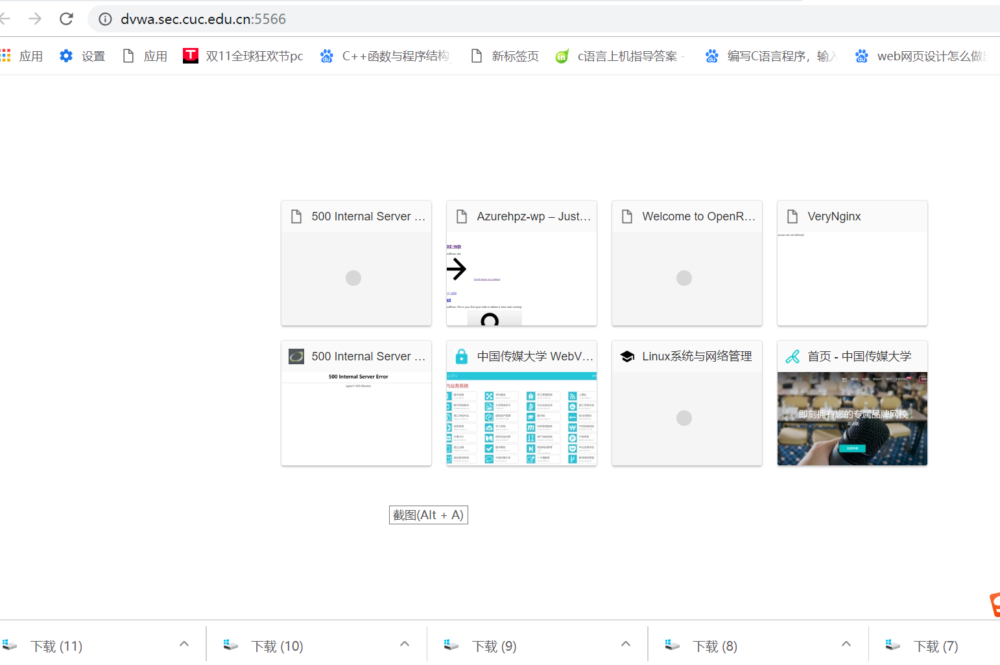
- 这时师姐指出是访问时php文件无法被解析，所以自动下载了。*问题2出现：配置文件php解析模块出错了*
     - 再重新查看dvwa.sec.cuc.edu.cn和wp配置文件的区别，震惊！竟然是因为多了一个`\`....
     - 删除后主动kill并start nginx（这里要注意要给进程一些反应时间，比如说~~烦躁地疯狂刷新下~~）
- 问题终于解决了...

## 参考文献
- [linux-2019-TheMasterOfMagic/chap0x05/readme.md](https://github.com/CUCCS/linux-2019-TheMasterOfMagic/tree/master/chap0x05)
- [linux-2020-AM00zero/chap0x05/web服务器实验报告.md
](https://github.com/CUCCS/linux-2020-AM00zero/blob/chap0x05/chap0x05/web服务器实验报告.md)
- [ubuntu18.04 使用apt-get的时候，始终显示“E:无法定位软件包”](https://blog.csdn.net/baidu_41858278/article/details/87564544)
- [Ubuntu18.04下配置wordpress站点环境](https://www.jianshu.com/p/a51889a5f00e)
- [How To Install WordPress with LEMP on Ubuntu 18.04](https://www.digitalocean.com/community/tutorials/how-to-install-wordpress-with-lemp-on-ubuntu-18-04)
- [what-does-this-nginx-error-rewrite-or-internal-redirection-cycle-mean](https://serverfault.com/questions/505098/what-does-this-nginx-error-rewrite-or-internal-redirection-cycle-mean)