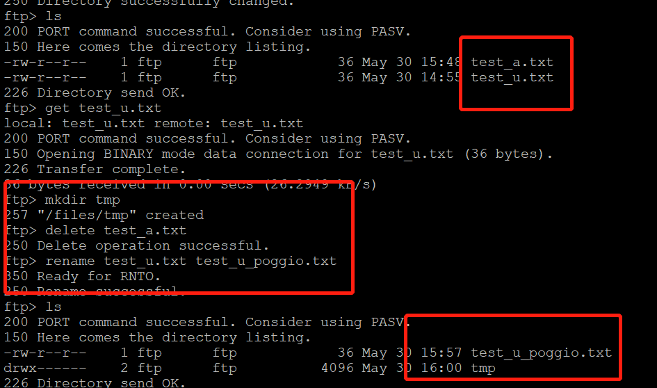
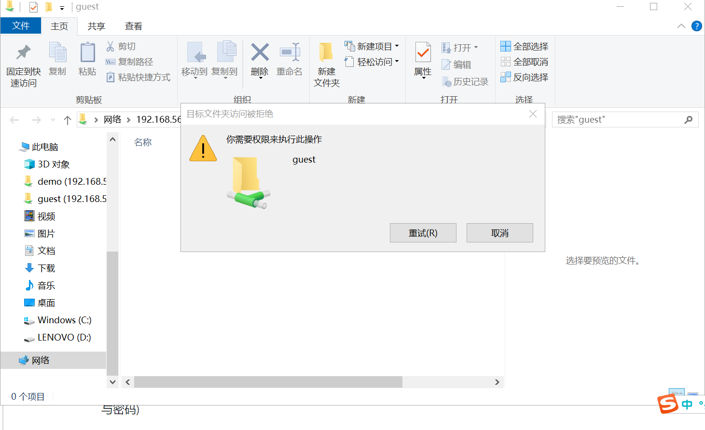

# 第六章：shell脚本编程练习进阶（实验）
FTP、NFS、DHCP、DNS、Samba服务器的自动安装与自动配置

## 软件环境建议
- FTP   
   - 对照第6章课件中的要求选择一款合适的FTP服务器软件支持所有任务要求
- NFS   
   - 对照第6章课件中的NFS服务器配置任务
- DHCP   
   - 2台虚拟机使用Internal网络模式连接，其中一台虚拟机上配置DHCP服务，另一台服务器作为DHCP客户端，从该DHCP服务器获取网络地址配置
- Samba   
   - 对照第6章课件中smbclient一节的3点任务要求完成Samba服务器配置和客户端配置连接测试
- DNS
   - 基于上述Internal网络模式连接的虚拟机实验环境，在DHCP服务器上配置DNS服务，使得另一台作为DNS客户端的主机可以通过该DNS服务器进行DNS查询
   - 在DNS服务器上添加 zone "cuc.edu.cn" 的以下解析记录

## shell脚本编程基本要求
- 目标测试与验证系统为本学期课程指定操作系统版本
- 自动安装与自动配置过程的启动脚本要求在本地执行
   - 提示：配置远程目标主机的SSH免密root登录，安装脚本、配置文件可以从工作主机（执行启动脚本所在的主机）上通过scp或rsync方式拷贝或同步到远程目标主机，然后再借助SSH的远程命令执行功能实现远程控制安装和配置
- 假设目标系统没有配置过root用户免密登录，所以我们要求在自动安装脚本中包含自动配置远程root用户免密登录的代码
- 脚本在执行过程中，如果需要在目标主机上创建目录、创建临时文件、执行网络下载等操作需要判断执行是否成功，并进行必要的异常处理（例如：apt-get update失败，则退出脚本执行，并将友好错误信息打印在控制台上。临时目录不存在，则自动创建该临时目录）
- 所有服务的配置文件、临时目录需设置正确的目录和文件归属和权限位，禁止使用777这种偷懒的权限位设置
- 减少不必要的安装过程中的人机交互输入，尽可能全部通过脚本的方式完成选项设置和交互式问题输入等
- 目标环境相关参数应使用独立的配置文件或配置脚本（在主调脚本中引用配置脚本）
   - 目标服务器IP
   - 目标服务器SSH服务的端口
   - 目标服务器上使用的用户名
   - 目标服务器上用于临时存储安装脚本、配置文件的临时目录路径

## 其他要求
- 撰写实验报告，证明你具体完成了哪些任务要求
- 所有脚本代码、配置文件均应包含在你的作业PR之中
- 脚本应在纯净未配置任何目标服务的系统和已完全配置好所有目标服务的系统2种典型测试用例条件下均能测试通过
- 对于在目标系统上已完成配置的服务，允许用本地的配置文件去覆盖远程已有的配置文件，但在执行覆盖操作之前应对远程已有的配置文件进行妥善备份

## 实验过程
- 工作主机：azurehpz@cuc-server 192.168.56.102
- 目标主机：root@cuc-client 192.168.56.101
### 0.配置远程目标主机的SSH免密root登录
- 目标主机SSH配置

      # 开启ssh服务
      sudo service ssh start
      # 修改ssh配置文件
      sudo vim /etc/ssh/sshd_config
      # 设置可通过口令认证SSH
      PasswordAuthentication yes
      # 允许root用户登录
      PermitRootLogin yes
      # 重启
      sudo systemctl restart ssh
      # 设置root用户密码
      sudo passwd
   
- 工作主机生成秘钥

      # 生成一对公私钥,foo2为文件名
      ssh-keygen -f .ssh/foo

      # 将公钥传输至目标主机authorized_keys文件
      ssh-copy-id -i ~/.ssh/foo2 root@192.168.56.101

      # 测试秘钥(此时需要输入密码)
      ssh root@192.168.56.101
   
- 目标主机设置免密登录

   - 取消root口令并禁用口令登录

         # 修改目标主机配置文件
         sudo vim /etc/ssh/sshd_config
         PasswordAuthentication no
         PermitRootLogin without-password

         # 重启ssh服务
         sudo systemctl restart ssh
   
### 1.FTP
 - 在工作主机上远程登录目标主机进行操作：
     - 将脚本文件`vsftpd.sh`拷贝到目标主机：
     
           scp -i .ssh/foo /home/azurehpz/scripts/ftp/vsftpd.sh root@192.168.56.101:/tmp/workspace/ftp
     - 借助SSH的远程命令执行功能实现目标主机控制安装和配置：
      
           ssh -i .ssh/foo root@192.168.56.101 'bash /tmp/workspace/ftp/vsftpd.sh'
      

 - ✅配置一个提供匿名访问的FTP服务器，匿名访问者可以访问1个目录且仅拥有该目录及其所有子目录的只读访问权限
 
 
 - ✅配置一个支持用户名和密码方式访问的账号，该账号继承匿名访问者所有权限，且拥有对另1个独立目录及其子目录完整读写（包括创建目录、修改文件、删除文件等）权限；
    - 用户账号密码登录
    
    - 在poggio用户的目录下出现了匿名用户目录下的文件，可证明继承匿名者访问权限 
    
    - 拥有对另1个独立目录及其子目录完整读写
    
 - ✅该账号仅可用于FTP服务访问，不能用于系统shell登录；
 
 - ✅FTP用户不能越权访问指定目录之外的任意其他目录和文件；
 
 - 匿名访问权限仅限白名单IP来源用户访问，禁止白名单IP以外的访问
 
 - 脚本：[vsftpd.sh](scripts\vsftpd.sh)
 - 配置文件：[/etc/vsftpd.conf](configs\vsftpd.conf)

### 2.NFS
- 将`nfs_server.sh`拷贝到工作主机，工作主机运行`nfs_server.sh`脚本 
   
- 目标主机查看nfs服务是否进行

- 目标主机运行`nfs_client.sh`脚本
- ✅在1台Linux上配置NFS服务，另1台电脑上配置NFS客户端挂载2个权限不同的共享目录，分别对应只读访问和读写访问权限
   - 创建的两个目录分别为:只读/nfs/gen_r和读写/nfs/gen_rw 
   
   
   - 两个共享文件目录对应只读和读写访问权限 
   
   
 - server脚本：[nfs_server.sh](scripts\nfs_server.sh)
 - client脚本：[nfs_client.sh](scripts\nfs_client.sh)
 - 配置文件：[/etc/exports](configs\exports)

### 3.DNS
 - ×基于上述Internal网络模式连接的虚拟机实验环境，在DHCP服务器上配置DNS服务，使得另一台作为DNS客户端的主机可以通过该DNS服务器进行DNS查询
 - 在DNS服务器上添加 zone "cuc.edu.cn" 的解析记录
     - server

       - 安装bind9
           
             apt-get update && apt-get upgrade && apt-get install bind9

        - 修改配置文件
             
              vim /etc/bind/named.conf.options

              #在options选项中添加以下配置
              listen-on { 192.168.56.101; };  # ns1 private IP address - listen on private network only
              allow-transfer { none; }; # disable zone transfers by default
              forwarders {
                 8.8.8.8;
                  8.8.4.4;
              };
        - 编辑配置文件
           
              vim /etc/bind/named.conf.local

              #添加如下配置
              zone "cuc.edu.cn" {
                  type master;
                  file "/etc/bind/db.cuc.edu.cn";
              };
           
        - 生成配置文件db.cuc.edu.cn
           
              cp /etc/bind/db.local /etc/bind/db.cuc.edu.cn
           
       - 编辑配置文件
           
             vim /etc/bind/db.cuc.edu.cn 
          
       - 重启bind9
       
              sudo service bind9 restart
    - client

      - 安装resolvconf
           
            sudo apt-get update && sudo apt-get upgrade &&sudo apt-get install resolvconf

      - 修改配置文件
        
            sudo vim /etc/resolvconf/resolv.conf.d/head

            #添加配置
            search cuc.edu.cn
            nameserver 192.168.56.1
      - sudo resolvconf -u
- 测试结果：不知道哪里出错了，解析出的主机名并不是内网ip

- 配置文件：
   - [/etc/bind/named.conf.options](configs\named.conf.options)
   - [/etc/bind/named.conf.local](configs\named.conf.local)
   - [/etc/bind/db.cuc.edu.cn](configs\db.cuc.edu.cn)

### 4.Samba
- 服务启动\停止\重启等命令：

      /etc/init.d/smbd {start|stop|reload|restart|force-reload|status}
- 在windows 10客户端上连接Linux上的Samba服务器
   - 关闭server的防火墙
     
         sudo ufw disable
   - 打开资源管理器，右键“此电脑”，选择“添加一个网络位置” 
   
   - ✅Linux设置匿名访问共享目录，无需用户密码打开，且不能新建文件夹
   
   - ✅Linux设置用户名密码方式的共享目录，且可以新建文件夹（用户密码是samba下设置的）
   
   

- 在Linux上连接Windows10上的服务器

      sudo apt install smbclient

   - Windows设置共享目录
      - 打开控制面板，进入“网络和共享中心”，点击左侧“更改高级共享设置”
      - 开启网络发现和文件共享，保存更改
      - 编辑要共享的文件夹，属性
      - 勾选“共享此文件夹”，并点击权限
      - 添加用户名，设置权限。账号密码登录共享目录的用户为lenovo（本机用户） ，匿名登录共享目录的用户为Everyone
      
      
      - 回到文件夹属性的“安全栏”，更改对应用户的权限。若没有相关用户，如Everyone，则要添加（用户应与权限里设置相同）
      
      
      - 结果：账号密码登录共享目录`samba_share_user`的用户为`lenovo` ，匿名登录共享目录`samba_user_anon`的用户为`Everyone` 
   - ✅Linux访问匿名共享目录(这里的demoUser必须同时为linux和windows用户)
   
   - ✅Linux访问用户名密码方式共享目录
   
 - ✅下载整个目录
 
- 脚本文件：[samba_server.sh](scripts\samba_server.sh)
- 配置文件：[/etc/samba/smb.conf](configs\smb.conf)

### 5.DHCP
- 2台虚拟机使用Internal网络模式连接，其中一台虚拟机上配置DHCP服务，另一台服务器作为DHCP客户端，从该DHCP服务器获取网络地址配置，server:目标主机；client:工作主机
- 先将两台虚拟机增加网卡为内部网络网络模式
   
   
- 通过scp将脚本dhcp.sh拷贝到目标主机，通过ssh方式远程执行脚本

      scp -i .ssh/foo /home/azurehpz/scripts/dhcp/dhcp.sh root@192.168.56.101:/tmp/workspace/dhcp
      ssh -i .ssh/foo root@192.168.56.101 'bash /tmp/workspace/dhcp/dhcp.sh'

- 查看server配置文件

      less /etc/netplan/01-netcfg.yaml
   
- 修改并查看client配置
      
      less /etc/netplan/01-netcfg.yaml
      #修改配置文件/etc/netplan/01-netcfg.yaml，#添加enp0s9,设置dhcp4: yes

      sudo netplan apply
      #使配置生效

      #查看client配置文件
      less /etc/netplan/01-netcfg.yaml
   
- 实验结果
  
  

- 脚本：[dhcp.sh](scripts\dhcp.sh)
- 配置文件：
    - [/etc/dhcp/dhcpd.conf](configs\dhcpd.conf)
    - [/etc/default/isc-dhcp-server](configs\isc-dhcp-server)

## 实验中出现的问题及解决方案
### 1.工作主机上生成私钥配置目标主机时，报错提示WARNING: REMOTE HOST IDENTIFICATION HAS CHANGED!

- 于是仔细查看报错，发现里面给出了解决方案
 
      Add correct host key in /home/azurehpz/.ssh/known_hosts to get rid of this message.
      Offending ECDSA key in /home/azurehpz/.ssh/known_hosts:2
      remove with:
      ssh-keygen -f "/home/azurehpz/.ssh/known_hosts" -R "192.168.56.101"
- 这才发现原因是我第一次配置root@192.168.56.101时已经生成了相应的私钥，而后来重装了系统，又生成了新的私钥，导致了冲突，所以重装系统后原来的私钥信息要及时删除
- 执行上述操作后，成功配置私钥进行登录
   

### 2.在设置免密码登录的时候，修改主机配置文件/etc/ssh/sshd_config后，进行重启，重启失败

- 在网络上搜索报错信息，得到如下解决方案：
   
      # 查看错误原因
      /usr/sbin/sshd -T  或  sshd -T
      # 返回报错信息
      /etc/ssh/sshd_config line 56: Bad yes/no argument: no`
      # 原来是不小心加多了一个符号导致重启失败
### 3.在Windows上配置一个网络位置时报错：无法访问\\192.168.56.101\guest
- 在网上搜索相应报错，更改了许多配置，最后发现是需要关闭192.168.56.101上的防火墙

     sudo ufw disable
- 更改了防火墙配置之后，可以成功新建网络位置，但是打开相应的文件夹又报错：无法访问\\192.168.56.101\guest
   - 进行报错检测时，详细信息显示：共享文件“192.168.56.102”存在，但 Windows 无法找到“guest”
   - 又进行报错搜索，一开始以为是guest账户没有建立，于是新建用户
    
         sudo useradd guest
   - 重启服务之后再次尝试打开，可是依旧报错，于是想到是路径出了问题，再次查看配置文件
         #原来的加载路径
         path = /home/samba/guest/
         #但是这个路径并不存在
         #更改加载路径
         path = /home/guest
   - 更改路径之后重启服务，成功打开共享文件夹
## 参考文献
- [CUCCS/linux-2019-TheMasterOfMagic](https://github.com/CUCCS/linux-2019-TheMasterOfMagic/tree/master/chap0x06)
- [linux系统644、755、777权限详解](https://blog.csdn.net/beyond_f4/article/details/81241144)
- [Centos 7 ssh服务无法启动job for sshd.service failed](https://blog.csdn.net/qq_34815528/article/details/90052813)
- [2015-linux-public-JuliBeacon/实验 6/在Linux和Windows间设置文件共享.md](https://github.com/CUCCS/2015-linux-public-JuliBeacon/blob/exp6/%E5%AE%9E%E9%AA%8C%206/%E5%9C%A8Linux%E5%92%8CWindows%E9%97%B4%E8%AE%BE%E7%BD%AE%E6%96%87%E4%BB%B6%E5%85%B1%E4%BA%AB.md)
- [linux-2020-cuc-Lynn/chap0x06实验报告.md](https://github.com/CUCCS/linux-2020-cuc-Lynn/blob/chap0x06/chap0x06%E5%AE%9E%E9%AA%8C%E6%8A%A5%E5%91%8A.md)